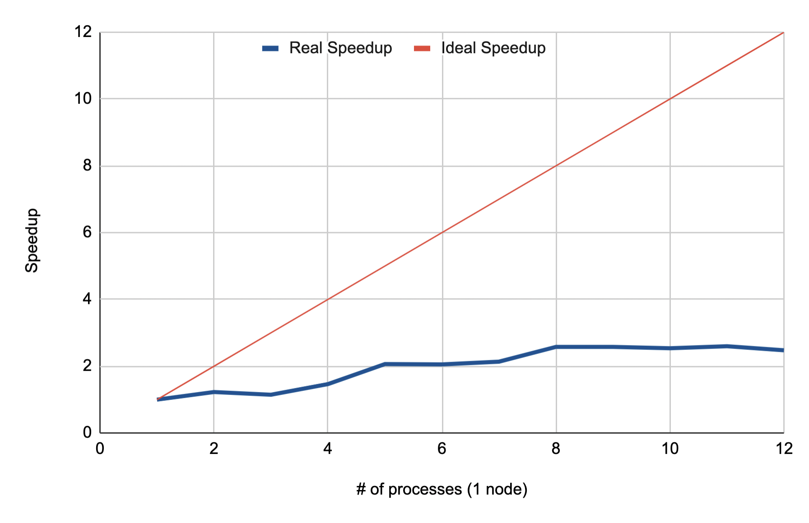
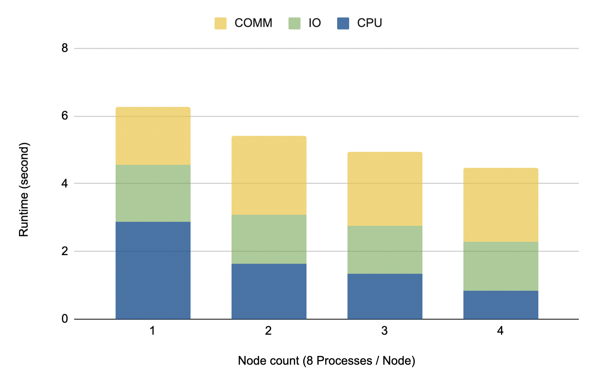

## <font size = 5> **HW1 Report** </font>
<p align="right"> 108062119 鄭幃謙 </p>

### <font size=4> **Inplementation** </font>
```cpp
int totalNum = atoi(argv[1]);
int partition = std::ceil(totalNum / (double)size);
int partitionSize = (rank >= totalNum) ? 0 : (rank == size - 1) ? (totalNum - partition * rank) : partition;
```
partitionSize表示的是每個process負責多少data，除了最後一個process都是做 n / NPROC 份，我的作法是對 n / size 向上取整，因為這樣分配會比較平均，方便後面交換data。最後一個process則是做剩下的數量。`(rank >= totalNum)` 是處理testcase03中 NPROC < n 的特殊情況。
```cpp
boost::sort::spreadsort::spreadsort(data, data + partitionSize);
```
接著是每個人將自己的那份data sort過，這樣之後不要動到數字的順序的話就不必再sort。
```cpp
int evenPartnerRank = (rank & 1) ? rank - 1 : rank + 1;
int oddPartnerRank = (rank & 1) ? rank + 1 : rank - 1;
if (oddPartnerRank == size || oddPartnerRank >= totalNum)
    oddPartnerRank = -1;
if (evenPartnerRank == size || evenPartnerRank >= totalNum)
    evenPartnerRank = -1;
int evenPartnerSize = (evenPartnerRank == size - 1) ? totalNum - partition * rank : partition;
int oddPartnerSize = (oddPartnerRank == size - 1) ? totalNum - partition * rank : partition;
```
這裡我計算在Odd-even sort過程中互換data對象的rank以及size，若是不存在的對象以-1表示。
```cpp
if (round & 1) { // even round.
    if (!(rank & 1)) { // stores smaller part.
        MPI_Sendrecv(&data[partitionSize - 1], 1, MPI_FLOAT, evenPartnerRank, EVEN, &partnerData[0], 1, MPI_FLOAT, evenPartnerRank, EVEN, MPI_COMM_WORLD, &status);
        if (data[partitionSize - 1] > partnerData[0]) {
            MPI_Sendrecv(data, partitionSize, MPI_FLOAT, evenPartnerRank, EVEN, partnerData, evenPartnerSize, MPI_FLOAT, evenPartnerRank, EVEN, MPI_COMM_WORLD, &status);
            memcpy(tempData, data, sizeof(float) * partitionSize);  
            for (int i(0), j(0), k(0); k < partitionSize; k++) {
                if (j == evenPartnerSize || (i < partitionSize && tempData[i] < partnerData[j]))
                    data[k] = tempData[i++];
                else
                    data[k] = partnerData[j++];
            }
        }
    }
}
```
data交換的過程我取其中一部分解釋。這是在even phase時左邊的process做的事，因為左邊的process是要存與partner中較小的部分，我先用 `MPI_Sendrecv()` 傳自己data中的最大值給對方，並接收對方data中的最小值，若自己的最大值仍小於對方的最小值，那就不必做交換。若非則再用 `MPI_Sendrecv()` 把所有data交換，並取兩者data中較小的那個部分。這裡我先傳一個數字來判斷是因為坐到後面的round時會有許多pair已經sort完成，就不需要再傳全部的data造成負擔。

### <font size=4> **Optimization** </font>
1. 使用Sendrecv()<br>
使用Sendrecv()會比使用send() + Recv()快。
2. 先取一個數字判斷是否要交換全部data <br>
可以降低不同process之間溝通的成本。


### <font size=4> **Experiment & Analysis** </font>
實驗中我使用課堂提供的機器，實驗data是testcases40，因為這個testcase很大較能看出parallel的加速效果。資料數量為536869888。<br>
我使用$<cmath>$中的函式計時，並分別做同node數不同process數量、process/node固定不同node數，並比較兩個實驗中實際數據與理想數據的差異，以及CPU, IO, COMM等不同part的耗時。

**Scalability** <br>
<center class="half">
 &emsp;&emsp; 
</center>
<center class="half">
<p>
Figure 1: Speedup for single node
&emsp;&emsp;&emsp;&emsp;&emsp;&emsp;&emsp;&emsp;Figure 2: Speedup for multi-node
</p>
</center>
<p>
從圖中可以知道scalability非常差，我想這是因為構通的成本太高，計算的部分雖然有減少但是加上溝通成本之後甚至會比原本還高，但是頻繁的溝通在odd-even sort中不可或缺，我想這部分的影響是不可避免的。
</p>
<br><br><br><br><br><br>

**Time Profile** <br>
<center class="half">
 &emsp;&emsp; 
</center>
<center class="half">
<p>
Figure 1: Runtime for single node
&emsp;&emsp;&emsp;&emsp;&emsp;&emsp;&emsp;&emsp;Figure 2: Runtime for multi-node
</p>
</center>

<p>
我認為bottleneck會是溝通的部分，從圖片中可以看出CPU的部分確實是已與process數量呈反比的成長，但Comm的部分確實不斷增加，使得整體時間不能達到ideal，這也驗證了我在scalability實驗中的想法。
</p>

### <font size=4> **Conclusion** </font>
這次作業是做odd-even sort，因為在odd-even sort中需要不斷的交換資料，對於parrell programming來說最大的問題就是溝通的成本，因此我想了很多方法來減少Send()、Recv()等函式的使用，但我的程式仍不能達到很好的scalability，我覺得這可能是我程式中不同process的時序沒有寫好使得溝通成本過高。<br>
我遇到最大的困難是我原本在odd phase和even phase中的buffer是不同的，這會導致testcase21和testcase28有WA，我大概在這個bug上花了10個小時才找到問題，但我仍不知道是什麼原因造成這個問題。<br>
在這次作業中我學到了mpi更深入的使用，我覺得在coding的過程中最有趣的是要如何讓多個process能夠彼此配合，以達到最好的平行計算效益，畢竟若不能比原本的效益高，使用平行計算反而效果更差。