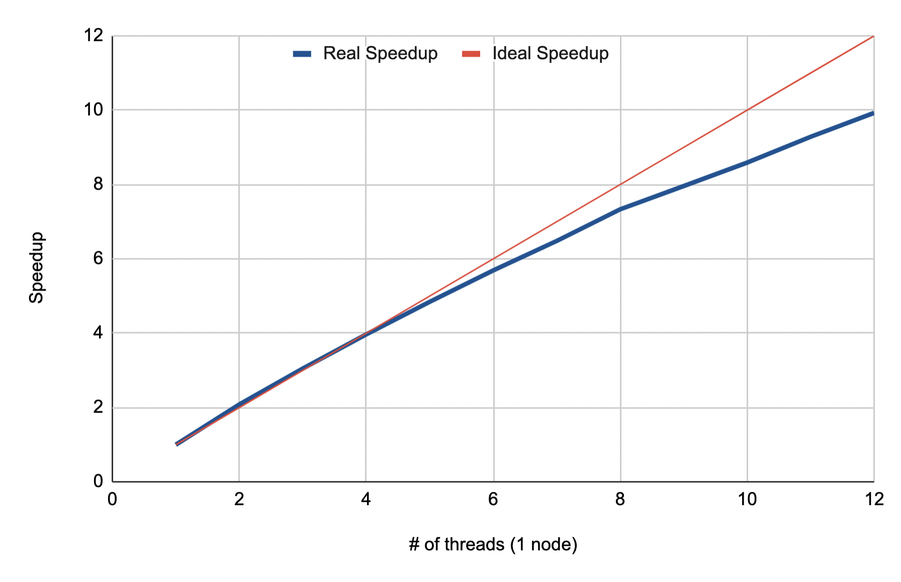
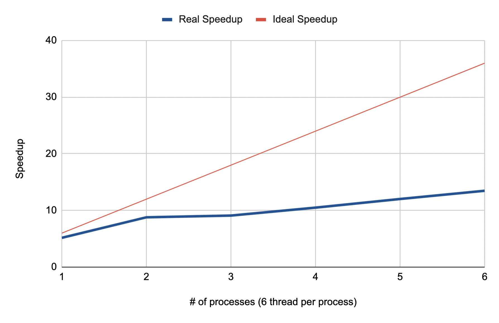
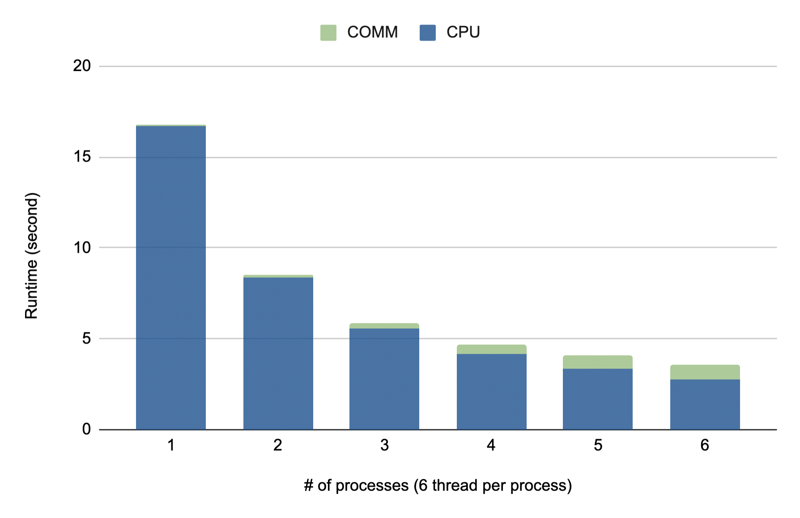
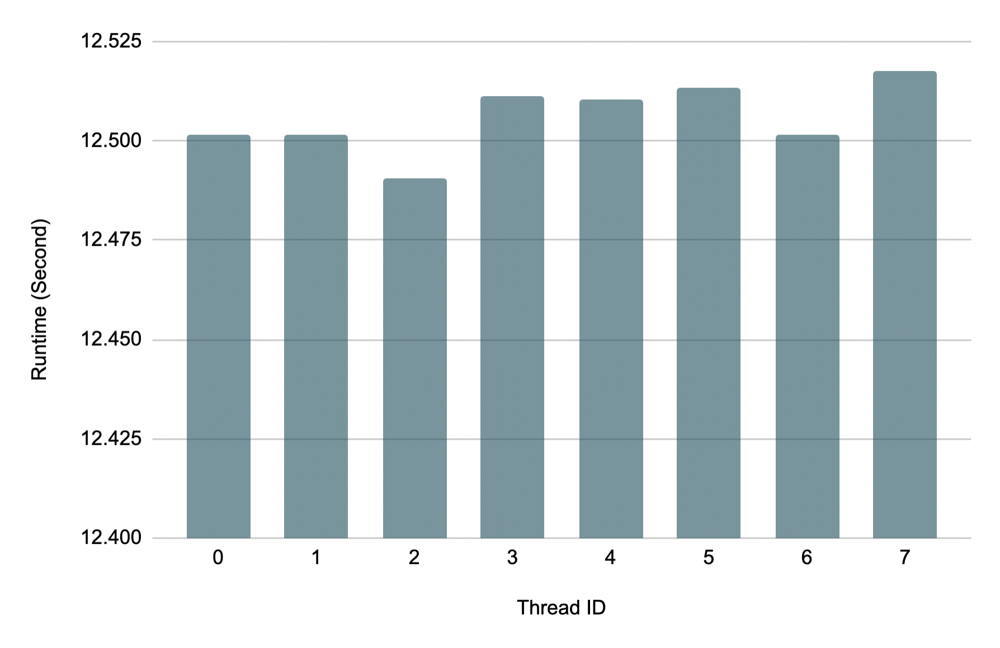
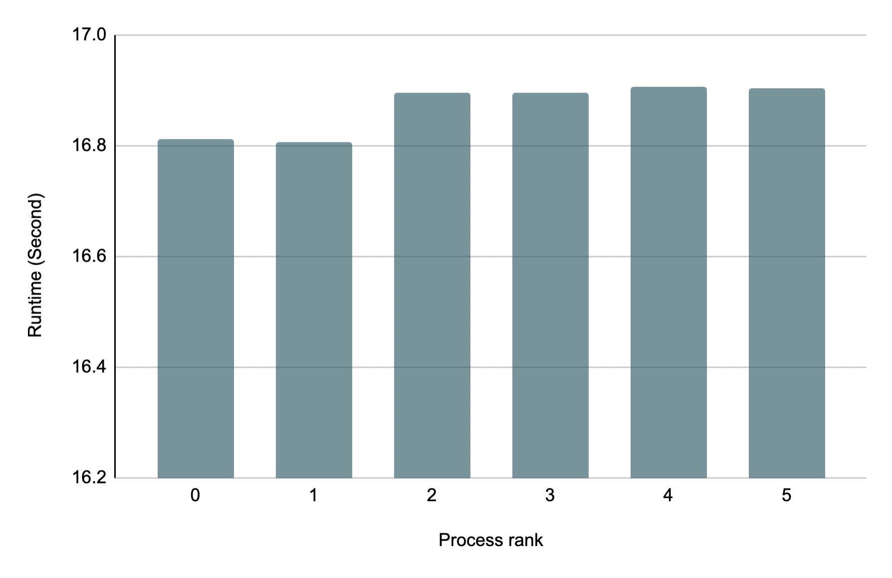
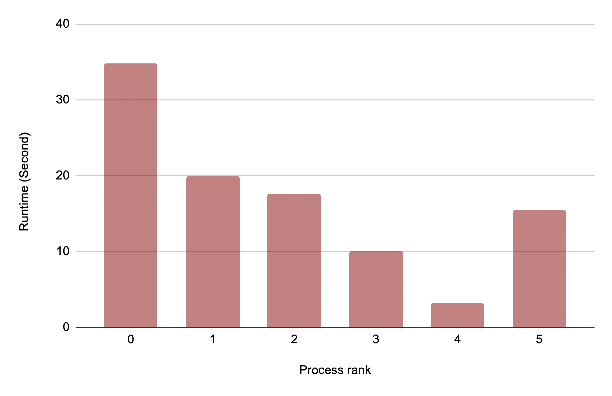

## <font size = 5> **HW2 Report** </font>
<p align="right"> 108062119 鄭幃謙 </p>

### <font size=4> **Implementation** </font>
**A. Pthread**<br>
**main()**
```cpp
pthread_t threads[ncpus];
pthread_mutex_init(&mutex, NULL);
for (int t = 0; t < ncpus; t++)
    pthread_create(&threads[t], NULL, Cal, NULL);
for (int t = 0; t < ncpus; t++)
    pthread_join(threads[t], NULL);
pthread_mutex_destroy(&mutex);
```
**Cal()**
```cpp
int row_local;
while (true) {
    pthread_mutex_lock(&mutex);
    if (row == height) { // end
        pthread_mutex_unlock(&mutex);
        break;
    }
    else // next row
        row_local = row++;
    pthread_mutex_unlock(&mutex);
    /* 
    calculation
    */
}
```
Pthread的部分我的作法是讓每個thread分別計算，並且用到dynamic schedule的方法，每個thread一次做一個row，做完之後再找下一個做，在找下一個row時用mutex鎖起來避免有兩個thread找到相同的row，如此load balance會比static schedule要好很多。<br>
接著計算的部分我有用SSE vectorization，128bit可以同時計算兩個double，因此我用兩個index分別表示同時在計算的兩個pixel，當其中一個index做到底表示結束了，就離開迴圈並且把剩下的部分做完。不過兩個pixel的計算不一定會同時結束，因此還要handle其中一個先結束的情況。<br>
因為我把image放到global，每個thread在計算完之後就可以直接寫進image，並且因為每個thread負責的部分不會有重疊，在寫進image時不用用到mutex，可以直接寫進自己負責的部分。
<br><br><br><br><br><br>

**B. Hybrid**<br>
**main()**
```cpp
int* image = (int*)calloc(width * height, sizeof(int));
#pragma omp parallel for schedule(dynamic)
for (int j = rank; j < height; j+= size) {
    /*
    calculation
    */
}
int* finalImage = (int*)calloc(width * height, sizeof(int));
MPI_Reduce(image, finalImage, width * height, MPI_INT, MPI_SUM, 0, MPI_COMM_WORLD);
if (rank == 0)
    write_png(filename, iters, width, height, finalImage);
```
Hybrid的部分我讓每個process隔著size選擇row，若不這樣做而是直接分好一個process負責一個區域，就會導致load balancing非常差，從產生中的圖片在有些區域有較多圖形、有些都是黑色可知，並且用到omp dynamic schedule的功能做到跟A部分類似的dynamic schedule。<br>
計算的部分用到SSE vectorization跟A部分一模一樣。<br>
這裡我把image改用`calloc()` allocate讓它初始成0，接著每個process把結果寫進image，最後再用`MPI_Reduce()`合起來，因為每個process負責的部分不會重疊，所以可以直接用sum的把所有結果加到finalImage，再由rank 0的process寫到output。


### <font size=4> **Optimization** </font>
**重複的計算**<br>
```cpp
while (index[0] < width && index[1] < width) {
    // y = 2 * x * y + y0
    y_v = _mm_add_pd(_mm_mul_pd(_mm_mul_pd(two, x_v), y_v), y0_v);
    // x = x * x - y * y + x0
    x_v = _mm_add_pd(_mm_sub_pd(x2_v, y2_v), x0_v);
    x2_v = _mm_mul_pd(x_v, x_v);
    y2_v = _mm_mul_pd(y_v, y_v);
    // length_squared = x * x + y * y
    length_squared_v = _mm_add_pd(x2_v, y2_v);
    /*
    calculation
    */
}
```
在計算的部分有許多重複用到的計算結果，尤其是x_square跟y_square，因此我在計算時將這兩個數字先算好，並在之後每次更新x和y時更新x_square和y_square。
<br><br><br><br>

### <font size=4> **Experiment & Analysis** </font>
實驗中我使用課堂提供的機器，實驗data是strict36。<br>
我使用<ctime>中的函式計時，並分別做vectorization對sequential code的優化、Pthread不同process數量、Hybrid固定node數不同process數，並比較兩個實驗中實際數據與理想數據的差異、CPU, COMM的耗時差異，以及load balance的比較。

**Sequential code optimization** <br>
原本的sequential code runtime為189.970s，用vectorization優化過的sequential code runtime為83.843s，speedup約為2.266。

**Scalability** <br>

<center class="half">
 &emsp;&emsp; 
</center>
<center class="half">
<p>
Figure 1. Speedup for Pthread
&emsp;&emsp;&emsp;&emsp;&emsp;&emsp;&emsp;&emsp;Figure 2. Speedup for Hybrid
</p>
</center>
<p>
從圖中可以知道Pthread的scalability非常好，我想這是因為用Pthread沒有MPI頻繁溝通導致communication cost很大的問題。<br>
Hybrid的scalability則沒有那麼好，我想是MPI的communication造成overhead，也因此在process數量為1的時候speedup確實是跟ideal差不多，process數量變多之後就比ideal要低一些。
</p>

**Time Profile** <br>
<center class="half">

</center>
<center class="half">
<p>
Figure 3. Runtime for Hybrid
</p>
</center>
<p>
圖中確實可以看出在process數量變多時，communication runtime也變多，因此讓scalability沒辦法更接近ideal。
</p>

**Load Balancing** <br>

<center class="half">
 &emsp;&emsp; 
</center>
<center class="half">
<p>
Figure 4. Runtime for Pthread
&emsp;&emsp;&emsp;&emsp;&emsp;&emsp;&emsp;&emsp;Figure 5. Runtime for Hybrid
</p>
</center>
<p>
從圖中可以知道兩者的load balance都很好，最大最小值相差都不超過0.1，這是dynamic schedule才能得到的結果。<br>
值得一提的是，下圖是我原本用別的方式分partition的load balancing。
</p>

<center class="half">

</center>
<center class="half">
<p>
Figure 6. Runtime for Hybrid with bad partition
</p>
</center>
<p>
圖中明顯看出load balancing非常的不平均，也因此我這個版本的code performance非常差。
</p>

### <font size=4> **Conclusion** </font>
這次作業中我學到最多的是SSE的使用，雖然在寫的時候遇到很多麻煩也一直上網查資料，但是他對sequential code的優化非常好。在作業中我遇到最大的問題是在計算時浮點數精度的問題，有一個testcase達不到100%讓我debug花了非常多時間。<br>
這次作業中我也了解到load balancing的重要性，在上次的作業中因為是將一大串相同的數學計算parallelize，不像這次的作業中會有不同區域計算量不同的問題，在如何分配partition就需要花更多心思，我也在錯誤中體會到load balancing對performance的重大影響。