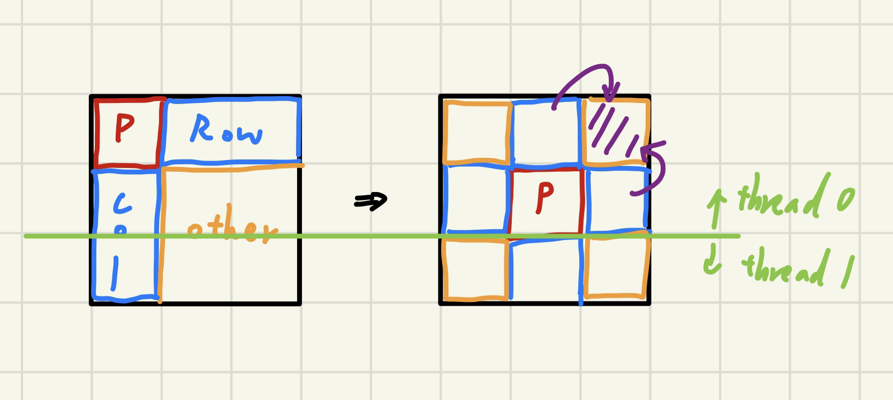
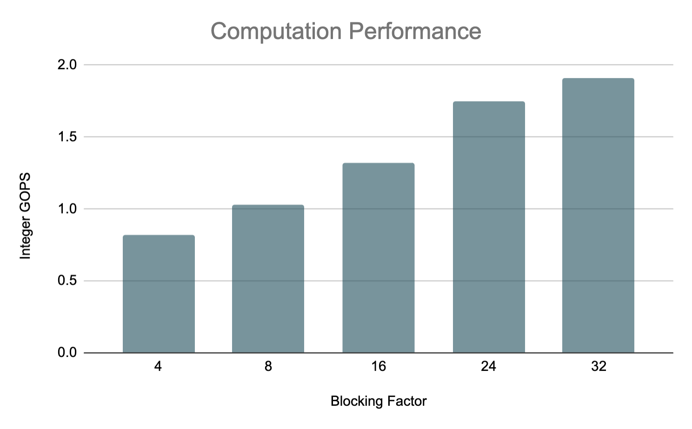
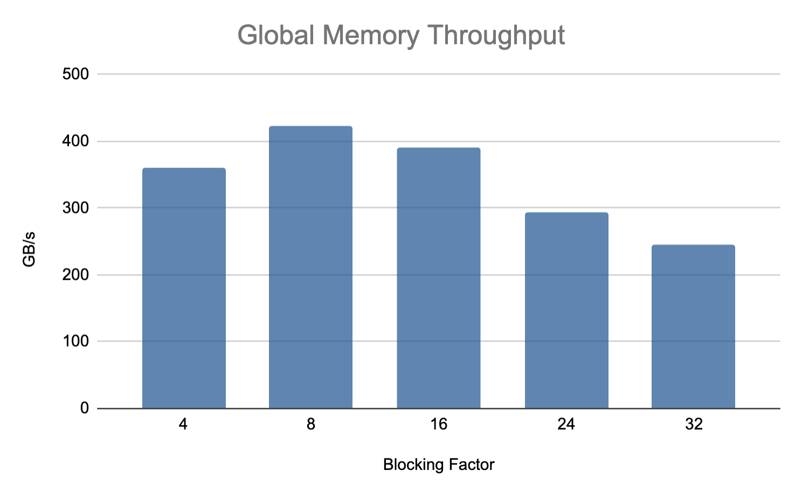
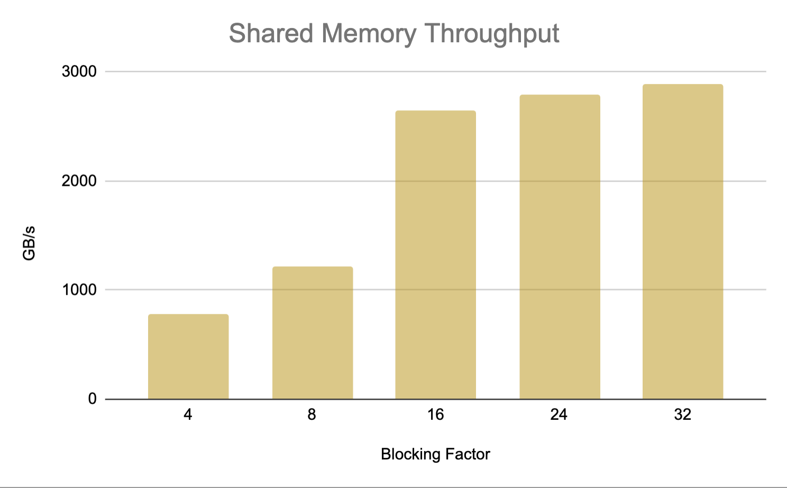
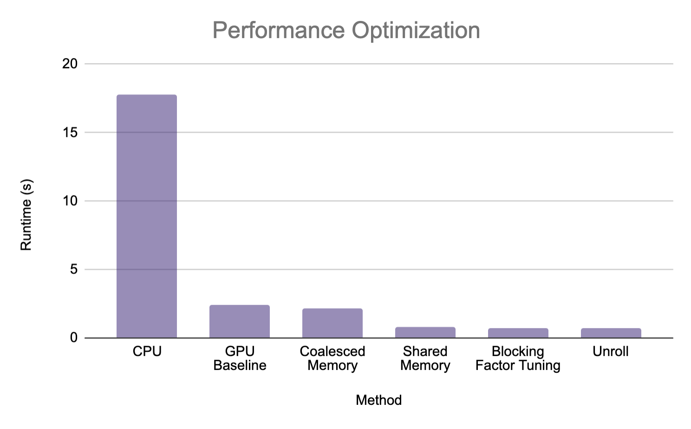
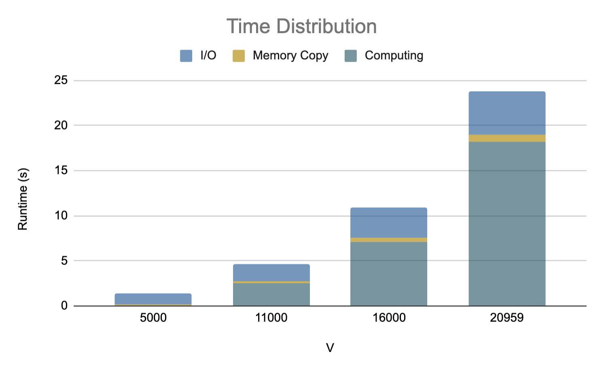

## <font size = 5> **HW3 Report** </font>
<p align="right"> 108062119 鄭幃謙 </p>

---

### <font size=4> **1. Implementation** </font>
**a. Which algorithm do you choose in hw3-1?**<br>
我使用的是Floyd Warshall algorithm，然後以pthread作平行，因為第k + 1輪的計算會用到第k輪的值，所以要使用barrier等待所有thread完成第k輪的計算。
```cpp
for (int k = 0; k < V; k ++) {
    for (int i = id; i < V; i += nThreads)
        for (int j = 0; j < V; j++)
            if (Dist[i][k] + Dist[k][j] < Dist[i][j])
                Dist[i][j] = Dist[i][k] + Dist[k][j];
    pthread_barrier_wait(&barrier);
}
```

**b. How do you divide your data in hw3-2, hw3-3?**<br>
我讓每個block對應到一個Blocked Floyd Warshall algorithm中的block，而在block中每一個thread對應到一個vertex。在Phase 1時只會用到pivot block自己的數值，在Phase 2時會用到Phase 1中計算的pivot block以及自己的數值，而在Phase 3時則需要自己對應到pivot row, pivot col的兩個block的數值。<br>
在hw3-2中，每個GPU block都有全部distance的值，因此只需要在計算時使用對應的block的數值。在hw3-3中，我把Phase 3的block分配給兩個GPU，若總block數量是奇數，則由第二個GPU多拿一個。<br>

**c. What's your configuration in hw3-2, hw3-3? And why?**<br>
**hw3-2**<br>
|  | blocking factor | nBlocks | nThreads |
| :----: | :----: | :----: | :----: |
| Phase 1 | 32 | 1 | (B, B) |
| Phase 2 | 32 | rounds | (B, B) |
| Phase 3 | 32 | (rounds, rounds) | (B, B) |

因為將blocking Factor設為32，且所有的block中的thread數量都是B * B，也就是1024，剛好達到cuda的上限，也因此讓每個thread剛好能對應到一個vertex。<br>
因此在Phase 1中只要計算pivot block就只需要一個block，而在Phase 2中需要計算2 * (rounds - 1)個block，因為我讓一個GPU block同時計算row和column上的block，因此我們需要rounds個block，在Phase 3則是計算剩下所有block，也就是(rounds - 1) * (rounds - 1)個block>。因此我們用到rounds個block。<br><br><br><br><br><br><br>

**hw3-3**<br>
|  | blocking factor | nBlocks | nThreads |
| :----: | :----: | :----: | :----: |
| Phase 1 | 32 | 1 | (B, B) |
| Phase 2 | 32 | rounds | (B, B) |
| Phase 3 | 32 | (rounds, split) | (B, B) |

與hw3-2類似，但是在Phase 3中，因為要把資料分給兩個GPU，因此一個CPU要用到(split * rounds);

**d. How do you imlpement the communication in hw3-3?**<br>
**e. Briefly describe your implementations**<br>

**hw3-2**<br>
先將讀進的V加上padding而能被B整除
```cpp
V_padding = (V % B == 0) ? V : (V / B + 1) * B;
```
將讀進的資料存為一維陣列Dist，size為V_padding * V_padding，並將edges讀進並寫進Dist。<br>
接著把Dist複製到device
```cpp
size_t size = sizeof(int) * V_padding * V_padding;
cudaMalloc(&Dist_device, size);
cudaMemcpy(Dist_device, Dist, size, cudaMemcpyHostToDevice);
```
根據V_padding, B算出總共需要的rounds數，並且在rounds內不斷進行Phase 1 -> Phase 2 -> Phase 3，最後算完之後把結果複製回host
```cpp
rounds = ceil(V_padding / B);
dim3 num_threads(B, B), num_blocks_3(rounds, rounds);
for (int round = 0; round < rounds; round++) {
    Phase1<<<1, num_threads>>>(Dist_device, round, V_padding);
    Phase2<<<rounds, num_threads>>>(Dist_device, round, V_padding);
    Phase3<<<num_blocks_3, num_threads>>>(Dist_device, round, V_padding);
}
cudaMemcpy(Dist, Dist_device, size, cudaMemcpyDeviceToHost);
```
在Phase 1中，根據threadIdx, round, B算出要計算的block位置，並用Floyd Warshall algorithm算出結果。
```cpp
int i = threadIdx.y + round * B;
int j = threadIdx.x + round * B;
for (int k = round * B; k < (round + 1) * B; k++) {
    if (d[i * v + k] + d[k * v + j] < d[i * v + j])
        d[i * v + j] = d[i * v + k] + d[k * v + j];
    __syncthreads();
}
```
在Phase 2中，根據blockIdx.y判斷是做row block還是col block並決定i, j，再以Floyd Warshall algorithm算出結果，這裡不用`__syncthreads()`是因為Phase 2只對Phase 1的結果有dependency。
```cpp
if (blockIdx.x == round) // pivot block
    return;
int i = threadIdx.y + blockIdx.x * B;
int j = threadIdx.x + blockIdx.x * B;
int pivot_i = threadIdx.y + round * B;
int pivot_j = threadIdx.x + round * B;
if (blockIdx.y == 0) // pivot row
    i = pivot_i;
else // pivot column
    j = pivot_j;
for (int k = round * B; k < (round + 1) * B; k++) {
    if (d[i * v + k] + d[k * v + j] < d[i * v + j])
        d[i * v + j] = d[i * v + k] + d[k * v + j];
}
```
在Phase 3中，根據threadIdx, blockIdx, B算出要計算的block位置，再以Floyd Warshall algorithm算出結果，這裡不用`__syncthreads()`是因為Phase 3只對Phase 2的結果有dependency。
```cpp
if (blockIdx.x == round || blockIdx.y == round) // calculated
        return;
int i = threadIdx.y + blockIdx.y * B;
int j = threadIdx.x + blockIdx.x * B;
for (int k = round * B; k < (round + 1) * B; k++) {
    if (d[i * v + k] + d[k * v + j] < d[i * v + j])
        d[i * v + j] = d[i * v + k] + d[k * v + j];
}
```
**hw3-3**<br>
在hw3-3中，使用兩個GPU實作，我使用OpenMP實作。因為主要是Phase 3的計算量很大，我在Phase 1, Phase 就使用原本的kernel function，而在Phase 3中，把所有要計算的block分成一半，但在不同round時，會有一些data需要溝通。舉例來說，當3 * 3的problem進行第二輪時，在計算最左上角的block時，會用到它左邊及下面的block的data，而它左邊的block是由另一個thread計算，下面則是上一輪做過的，因此需要複製的是另一個thread的row block。如下圖：
<center class="half">

</center>

```cpp
int curRow = round * B * V_padding;
if ((round >= offset) && (round < offset + round_split))
    cudaMemcpy(Dist_device[otherid] + curRow, Dist_device[id] + curRow, sizeof(int) * B * V_padding, cudaMemcpyDeviceToDevice);
```

### <font size=4> **2. Profiling Results** </font>
使用p11k1作為testcase。
| | Min | Max | Avg |
| :----: | :----: | :----: | :----: |
| occupancy | 0.876928 | 0.87828 | 0.877548 |
| SM efficiency | 99.71% | 99.88% | 99.87% |
| shared memory load throughput | 2820.5 GB/s | 2864.6 GB/s | 2835.9 GB/s |
| shared memory store throughput | 117.52 GB/s | 119.36 GB/s | 118.16 GB/s |
| global memory load throughput | 176.28 GB/s | 179.04 GB/s | 177.25 GB/s |
| global memory store throughput | 58.759 GB/s | 59.680 GB/s | 59.082 GB/s |

### <font size=4> **3. Experiment & Analysis** </font>
**a. System Spec**<br>
使用課程提供的hades。<br>
**b. Blocking Factor**<br>
使用c20.1作為testcase，GOPS為integer instruction除以total time，memory bandwidth為load, store加總。
<center class="half">

</center>
<center class="half">
<p>
Figure 1. Computation performance
</p>
</center>
<center class="half">

</center>
<center class="half">
<p>
Figure 2. Global memory throughput
</p>
</center>
<center class="half">

</center>
<center class="half">
<p>
Figure 3. Shared memory throughput
</p>
</center>
圖1中可以看出Blocking factor越大越好，圖2可以發現Blocking factor越大時需要access global memory的傳輸量變少，圖3可以發現Blocking factor越大使用shared memory越多。因此我選擇32。<br><br><br><br><br><br><br><br><br><br><br><br>

**c. Optimization**<br>
<center class="half">

</center>
<center class="half">
<p>
Figure 4. Performance optimization
</p>
</center>
圖中可以看出shared memory的優化是最多的。

**d. Time Distribution**<br>
<center class="half">

</center>
<center class="half">
<p>
Figure 4. Time distribution
</p>
</center>
圖中可以看出最耗時的還是computing，因此若要繼續優化的方向還是往這方面為主，不過越大的testcase可以看到I/O也會是一個負擔，我想這兩方面還有優化空間。

### <font size=4> **4. Experience & Conclusion** </font>
這次作業中我花了非常多的時間，在寫的時候遇到很多麻煩一直上網查資料，在過程中學到了很多東西，但最後還是無法過全部的測資，還是有點遺憾。<br>
我學到最多的是nvprof的使用，它能看到很多程式執行的細節，對於程式開發者有很大的幫助。