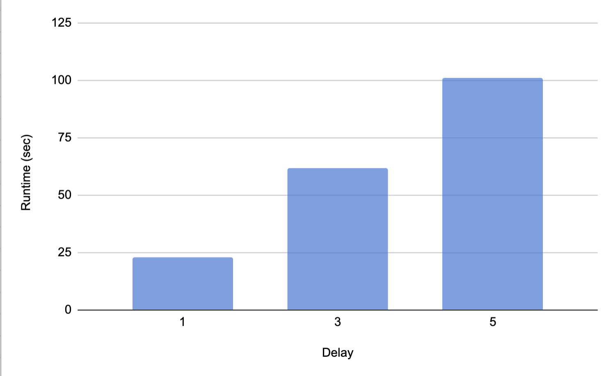
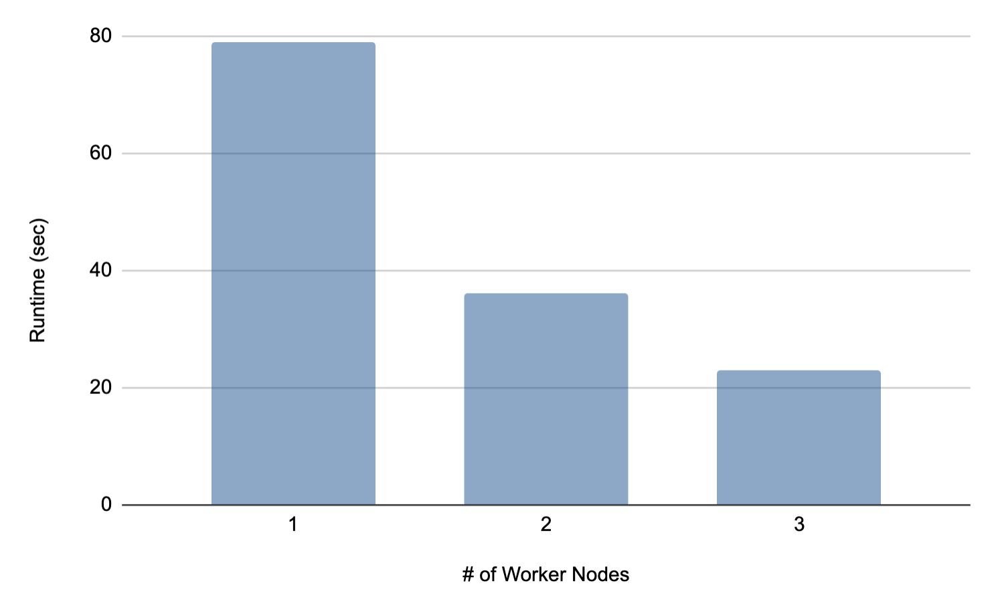
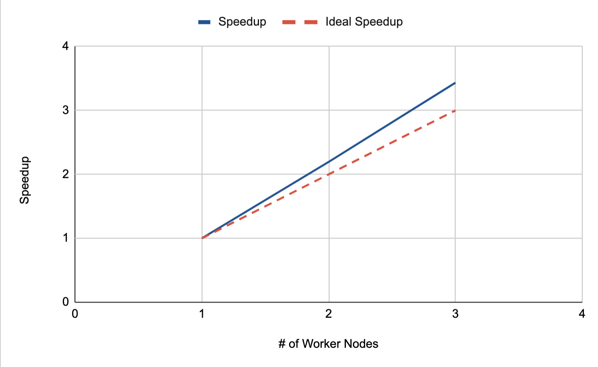

##  **HW4 Report** 

 108062119 鄭幃謙 

---

###  **1. Implementation** 
**data locality-aware scheduling algorithm** 
因為我是以rank為0的process作為`Job tracker`，其他作為`Task tracker`，因此我把nodeID mod (`size` - 1) 後再 + 1。

**Job tracker** 
在Map階段時，`Job tracker`會接收來自`Task tracker` node的request，並將對應的chunk交給他，若沒有的話則回傳第一個。 
當mapping task全部都分配完之後，`Job tracker`會再傳一次value為-1的info給各個Task tracker，以此告訴他們mapping task已經發完了。 
在Shuffle階段時，`Job tracker`先開啟`num_reducer`個intermediate-reducer file，並且將先前mapper產生的intermediate files讀進後，根據partition function決定各由哪個reducer負責，並寫進對應的intermediate-reducer file。在這裡我的parition function是將第一個字母mod `num_reducer`。 
在Reduce階段則與Map階段相似，也同樣在最後傳送-1作為結束的訊號。在Reduce和Map階段結束時都會接收`Task tracker`傳來的Complete info並輸出到log。 

**Task tracker** 
`Task tracker`會創造(size - 1)個thread作為mapper，mapper會將input讀入後拆解成line，再拆解成word，並寫進intermediate file中，讓`Job tracker`在Shuffle階段使用。 
reducer只有一個thread，會將分配到的chunk進行sort, group後再進行reduce，再寫到.out檔中。在Reduce和Map階段結束時都會傳送紀錄的Complete info給`Job tracker`。 

**Sort function** 
我是使用default的ASCII排列。 

**Group function** 
我是使用default的完全相同字。 

**Challenges encountered** 
在多個thread執行的mapper function中，我原本的寫法是等到有task進來才開始動，但這樣會讓程式執行時間變得很長，因此我後來改成利用`pthread_cont_wait`等待並將mutex放出，然後在外面接收到新的task並push進task queue時call `pthread_cond_signal`，如此一來在效率上有很大的改善。 
我剛開始在`MPI_Recv`和`MPI_Send`的tag使用有出問題，但因爲他就是在執行的時候卡住所以我也不知道錯在哪裡，在花了很長時間檢查code之後才發現這個錯誤，我後來也改以define的名字來代表各種tag，增加code的可讀性以免又發生這種難以發現的bug。         

###  **2. Experiment & Analysis** 

**System Spec** 
使用課堂提供的Apollo。 
testcase為share/testcases/06，行數為5000，NODES: 4, CPUS: 4, NUM_REDUCER: 9, CHUNK_SIZE: 20。

**Data Locality** 
我透過將DELAY改變觀察locality的重要性。 

Figure 1. Data Locality

雖然看得出data locality的重要性，但我想是計算時間太短了因此執行時間只算到sleep的秒數。 

**Scalability** 

 &emsp;&emsp; 

Figure 2. Time profile
&emsp;&emsp;&emsp;&emsp;&emsp;&emsp;&emsp;&emsp;Figure 3. Speedup

可見speedup甚至比理想的要高，我想這是因為nodes變多不只是平行加速，data locality 的因素也讓他變得更快。      

###  **3. Experience & Conclusion** 
這次的作業因為在期末特別忙沒有很多時間可以寫，不過還是順利完成了，這次學到了更多MPI和pthread的應用，成功寫出來也非常開心。 
謝謝老師和助教這學期的教導。